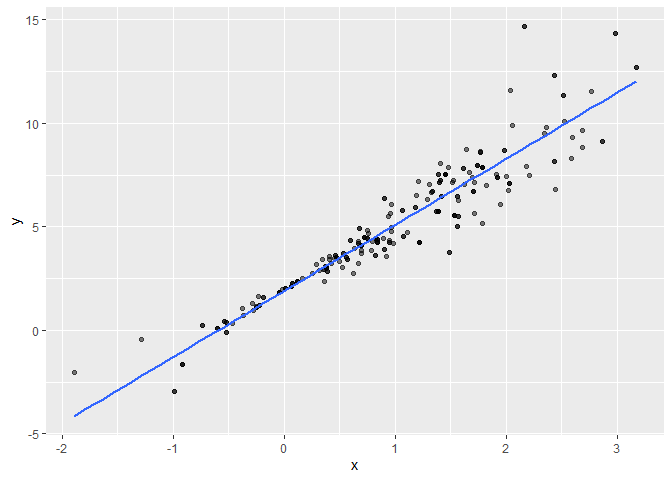
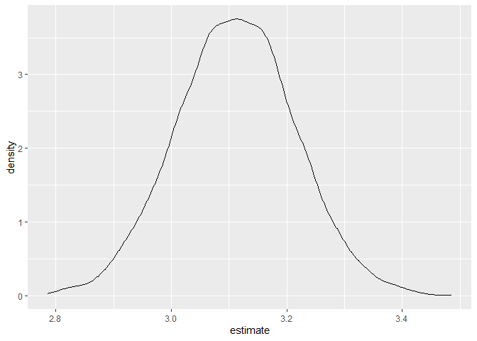
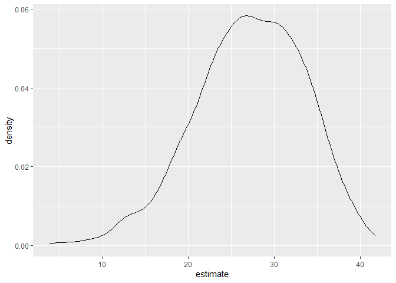

Bootstrapping
================
Te-Hsuan Huang
2025-11-28

``` r
library(tidyverse)
```

    ## Warning: package 'tidyverse' was built under R version 4.5.2

    ## ── Attaching core tidyverse packages ──────────────────────── tidyverse 2.0.0 ──
    ## ✔ dplyr     1.1.4     ✔ readr     2.1.5
    ## ✔ forcats   1.0.0     ✔ stringr   1.5.1
    ## ✔ ggplot2   3.5.2     ✔ tibble    3.3.0
    ## ✔ lubridate 1.9.4     ✔ tidyr     1.3.1
    ## ✔ purrr     1.1.0     
    ## ── Conflicts ────────────────────────────────────────── tidyverse_conflicts() ──
    ## ✖ dplyr::filter() masks stats::filter()
    ## ✖ dplyr::lag()    masks stats::lag()
    ## ℹ Use the conflicted package (<http://conflicted.r-lib.org/>) to force all conflicts to become errors

``` r
library(p8105.datasets)

set.seed(1)
```

# make a series number

``` r
n_samp = 250

sim_df_const = 
  tibble(
    x = rnorm(n_samp, 1, 1),
    error = rnorm(n_samp, 0, 1),
    y = 2 + 3 * x + error
  )

sim_df_nonconst = sim_df_const |> 
  mutate(
  error = error * .75 * x,
  y = 2 + 3 * x + error
)
```

# fit a model

``` r
sim_df_const |> 
lm(y ~ x, data = _) |> 
  broom::tidy() |> 
  knitr::kable(digits = 3)
```

| term        | estimate | std.error | statistic | p.value |
|:------------|---------:|----------:|----------:|--------:|
| (Intercept) |    1.977 |     0.098 |    20.157 |       0 |
| x           |    3.045 |     0.070 |    43.537 |       0 |

``` r
sim_df_nonconst |> 
lm(y ~ x, data = _) |> 
  broom::tidy() |> 
  knitr::kable(digits = 3)
```

| term        | estimate | std.error | statistic | p.value |
|:------------|---------:|----------:|----------:|--------:|
| (Intercept) |    1.934 |     0.105 |    18.456 |       0 |
| x           |    3.112 |     0.075 |    41.661 |       0 |

# write a function for boostrap

``` r
boot_sample = function(df) {
  sample_frac(df, size = 1, replace = TRUE)
}
```

- replace=TRUE: This is the crucial part. It means that after a row is
  selected, it is “replaced” back into the pool of rows and can be
  selected again.

- Test the function

``` r
sim_df_nonconst |> 
boot_sample() |> 
  ggplot(aes(x = x, y = y)) + 
  geom_point(alpha = .5) +
  stat_smooth(method = "lm", se=FALSE)
```

    ## `geom_smooth()` using formula = 'y ~ x'

<!-- -->

# Draw many boostrap sample

``` r
boot_straps = 
  tibble(strap_number = 1:5000) |> 
  mutate(
    strap_sample = map(strap_number, \(i) boot_sample(df = sim_df_nonconst))
  )

boot_straps
```

    ## # A tibble: 5,000 × 2
    ##    strap_number strap_sample      
    ##           <int> <list>            
    ##  1            1 <tibble [250 × 3]>
    ##  2            2 <tibble [250 × 3]>
    ##  3            3 <tibble [250 × 3]>
    ##  4            4 <tibble [250 × 3]>
    ##  5            5 <tibble [250 × 3]>
    ##  6            6 <tibble [250 × 3]>
    ##  7            7 <tibble [250 × 3]>
    ##  8            8 <tibble [250 × 3]>
    ##  9            9 <tibble [250 × 3]>
    ## 10           10 <tibble [250 × 3]>
    ## # ℹ 4,990 more rows

# Analyzing bootstrap samples

``` r
bootstrap_results = 
  boot_straps |> 
  mutate(
    models = map(strap_sample, \(df) lm(y ~ x, data = df) ),
    results = map(models, broom::tidy)) |> 
  select(-strap_sample, -models) |> 
  unnest(results) 
```

- Summary

``` r
bootstrap_results |> 
  group_by(term) |> 
  summarize(
    boot_estimate = mean(estimate),
    boot_se = sd(estimate)
    ) |> 
  knitr::kable(digits = 3)
```

| term        | boot_estimate | boot_se |
|:------------|--------------:|--------:|
| (Intercept) |         1.933 |   0.076 |
| x           |         3.112 |   0.103 |

- Look on the plot

``` r
bootstrap_results |> 
  filter(term == "x") |> 
  ggplot(aes(x=estimate))+ 
  geom_density()
```

<!-- -->

- Add CI

``` r
bootstrap_results |> 
  group_by(term) |> 
  summarize(
    ci_lower = quantile(estimate, 0.025), 
    ci_upper = quantile(estimate, 0.975))
```

    ## # A tibble: 2 × 3
    ##   term        ci_lower ci_upper
    ##   <chr>          <dbl>    <dbl>
    ## 1 (Intercept)     1.78     2.09
    ## 2 x               2.91     3.32

# do it faster

``` r
sim_df_nonconst |> 
  modelr::bootstrap(n = 1000) |> 
  mutate(
    models = map(strap, \(df) lm(y ~ x, data = df) ),
    results = map(models, broom::tidy)) |> 
  select(-strap, -models) |> 
  unnest(results) |> 
  group_by(term) |> 
  summarize(
    boot_estimate = mean(estimate),
    boot_se = sd(estimate)
    )
```

    ## # A tibble: 2 × 3
    ##   term        boot_estimate boot_se
    ##   <chr>               <dbl>   <dbl>
    ## 1 (Intercept)          1.93  0.0746
    ## 2 x                    3.12  0.101

- constant

``` r
sim_df_const |> 
  modelr::bootstrap(n = 1000) |> 
  mutate(
    models = map(strap, \(df) lm(y ~ x, data = df) ),
    results = map(models, broom::tidy)) |> 
  select(-strap, -models) |> 
  unnest(results) |> 
  group_by(term) |> 
  summarize(
    boot_estimate = mean(estimate),
    boot_se = sd(estimate)
    )
```

    ## # A tibble: 2 × 3
    ##   term        boot_estimate boot_se
    ##   <chr>               <dbl>   <dbl>
    ## 1 (Intercept)          1.98  0.0980
    ## 2 x                    3.04  0.0718

# Change the dataset

``` r
data("nyc_airbnb")

nyc_airbnb = 
  nyc_airbnb |> 
  mutate(stars = review_scores_location / 2) |> 
  rename(
    borough = neighbourhood_group,
    neighborhood = neighbourhood) |> 
  filter(borough != "Staten Island") |> 
  drop_na(price, stars, room_type) |> 
  select(price, stars, borough, room_type)
```

- make a plot

``` r
nyc_airbnb |> 
  ggplot(aes(x = stars, y = price, color = room_type)) + 
  geom_point() 
```

<!-- -->

- try to do bootstrap

``` r
nyc_airbnb |> 
  filter(borough == "Manhattan") |> 
  modelr::bootstrap(n = 1000) |> 
  mutate(
    models = map(strap, \(df) lm(price ~ stars + room_type, data = df)),
    results = map(models, broom::tidy)) |> 
  select(.id, results) |> 
  unnest(results) |> 
  filter(term == "stars") |> 
  ggplot(aes(x = estimate)) + 
  geom_density()
```

<!-- -->

- modelr::bootstrap(n = 1000): This tells R to generate 1,000 distinct
  bootstrap samples from the Manhattan-only data frame.
